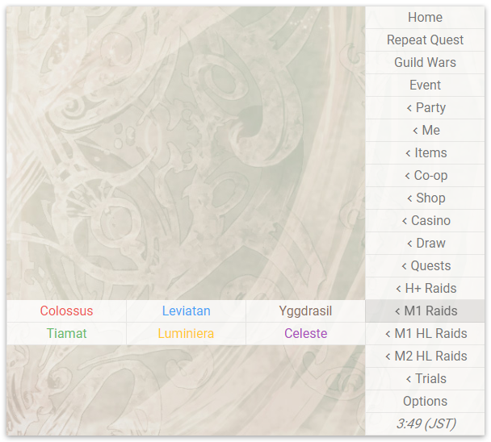
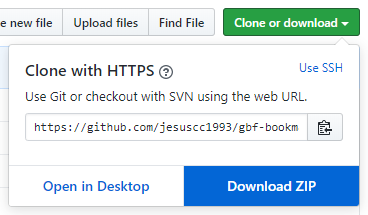

# GBF Bookmarker

## Index

- [What it does](#what-it-does)
- [How it works](#how-it-works)
- [Limitations](#limitations)
- [Special bookmarks](#special-bookmarks)
- [Bookmarks list](#bookmarks-list)
- [Installation](#installation)

## What it does

GBF Bookmarker is a [Chrome](https://www.google.com/chrome/) [extension](https://developer.chrome.com/extensions) that provides [bookmarks](<https://en.wikipedia.org/wiki/Bookmark_(digital)>) to all the features one might possible want to access in [Granblue Fantasy](http://game.granbluefantasy.jp). The visibility for every bookmark group can be individually configured from the options page, accessible from the extension's menu itself.

## How it works

It watches changes to URLs to register changing URLs, such as events, and saves them to the extension storage for later use. It also uses this same storage to save user preferences, which dictate which bookmark groups will show in the extension's menu.

The extension _only_ communications with the browser through the [Chrome Extension API](https://developer.chrome.com/extensions/api_index). Nothing is ever injected into the game, so the extension should be undetectable.

\* _**Disclaimer**_: even so, I will not be held responsible for anything that happens to you if you decide to use the extension.

## Limitations

As there's no real communication with the game, quests with requirements or limitted daily runs will return an error when you enter them if you're not supposed to be able. This can be fixed by navigating to a different bookmark.

For temporal quests and events (including Guild Wars), you will likely be redirected to the home page instead.

## Special bookmarks

There are some special bookmarks that work by saving the latest URL the user visitted matching certain rules. These include:

- **Repeat Quest**: will take you to the last quest where a support summon was selected. Quests with no support summon will not register and I have found no way around this. Luckily, they are a vast minority.

- **Guild Wars**: will take you to the last guild wars (AKA [Unite and Fight](https://gbf.wiki/Unite_and_Fight)) you visitted.

- **Event**: will take you to the last event you visitted.

## Bookmarks list

| Bookmark group    | Child bookmarks    |                 |               |
| ----------------- | ------------------ | --------------- | ------------- |
| **Home**          |                    |                 |               |
| **Repeat Quest**  |                    |                 |               |
| **Guild Wars**    |                    |                 |               |
| **Event**         |                    |                 |               |
| **Party**         | Characters         | Weapons         | Summons       |
| **Me**            | Profile            | Journal         | Crew          |
|                   | Friends            | Trophies        |               |
| **Inventory**     | Characters         | Weapons         | Summons       |
|                   | Outfit             |                 |               |
| **Upgrade**       | Character          | Weapon          | Summon        |
| **Items**         | Inventory          | Upgrade         | Uncap         |
|                   | Stash              | Crate           | Supplies      |
| **Co-op**         | Co-op              | Join            | Shop          |
| **Shop**          | MobaCoins          | Crystals        | Treasure      |
|                   | Pendants           | Weapon Series   | Trade Moons   |
|                   | Journey Drops      | Cerulean Stones | Arcanum       |
| **Casino**        | Poker              | Bingo           | Cage          |
| **Draw**          | Premium            | Rupie           |               |
| **Quests**        | Featured           | Special         | Raids         |
|                   | Side Stories       | Fate Episodes   | Pending Raids |
|                   | Trial Battles      | Arcanum         |               |
| **H Raids**       | Colossus           | Leviatan        | Yggdrasil     |
|                   | Tiamat             | Luminiera       | Celeste       |
| **H+ Raids**      | Colossus           | Leviatan        | Yggdrasil     |
|                   | Tiamat             | Luminiera       | Celeste       |
| **M1 Raids**      | Colossus           | Leviatan        | Yggdrasil     |
|                   | Tiamat             | Luminiera       | Celeste       |
| **M1+ Raids**     | Colossus           | Leviatan        | Yggdrasil     |
|                   | Tiamat             | Luminiera       | Celeste       |
| **M1 HL Raids**   | Colossus           | Leviatan        | Yggdrasil     |
|                   | Tiamat             | Luminiera       | Celeste       |
| **M2 HL Raids**   | Shiva              | Europa          | Alexiel       |
|                   | Grimnir            | Metatron        | Avatar        |
| **T1 Summons**    | Twin Elements      | Macula Marius   | Medusa        |
|                   | Nezha              | Apollo          | Olivia        |
| **T1 Summons HL** | Twin Elements      | Macula Marius   | Medusa        |
|                   | Nezha              | Apollo          | Olivia        |
|                   | Rose Queen         |                 |               |
| **T2 Summons**    | Grani              | Athena          | Baal          |
|                   | Garuda             | Odin            | Lich          |
| **T3 Summons HL** | Prometheus         | Ca Ong          | Gilgamesh     |
|                   | Morrigna           | Hector          | Anubis        |
| **Beasts HL**     | Huanglong & Qilin  |                 |               |
| **Malice HL**     | Tiamat Malice      |                 |               |
| **Nightmare**     | Proto Bahamut      | Grand Order     | Huanglong     |
|                   | Qilin              |                 |               |
| **Nightmare HL**  | Proto Bahamut      | Akasha          | Lucilius      |
|                   | The Four Primarchs |                 |               |
| **Primarchs**     | Michael            | Gabriel         | Uriel         |
|                   | Raphael            |                 |               |
| **Ultimate**      | Ultimate Bahamut   |                 |               |
| **Ultimate HL**   | Ultimate Bahamut   |                 |               |
| **Rapture HL**    | Lucilius           |                 |               |
| **Trials**        | Fire               | Water           | Earth         |
|                   | Wind               | Light           | Odin          |
| **Extra**         | News               | Updates         | Wiki          |

## Installation

Chrome's extension store is not free to publish to, so the extension requires to be installed manually. You can follow [these instructions](https://stackoverflow.com/questions/21581645/install-google-chrome-extension-from-script/21588748#21588748) in order todo so (you will need to download and decompress the extension first).

## Update

1. Download the updated files.
2. Extract them in the location of your current version of the extension and override them.
3. Load the updated extension from the "Load unpacked" button ([instructions](https://stackoverflow.com/questions/21581645/install-google-chrome-extension-from-script/21588748#21588748)).
