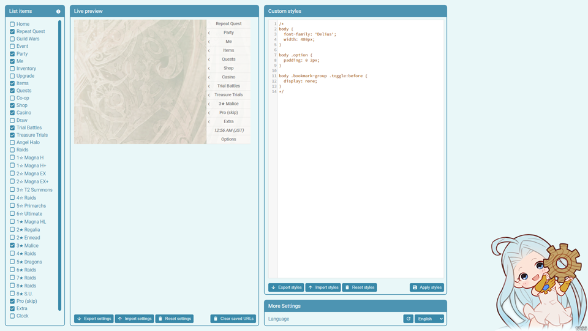

# GBF Bookmarker

## Index

- [What it does](#what-it-does)
- [How it works](#how-it-works)
- [Limitations](#limitations)
- [Special bookmarks](#special-bookmarks)
- [Bookmarks list](#bookmarks-list)
- [Shortcuts list](#shortcuts-list)
- [Installation](#installation)
- [Update](#update)
- [Configuration](#configuration)

## What it does

GBF Bookmarker is a [Chrome](https://www.google.com/chrome/) [extension](https://developer.chrome.com/extensions) that provides [bookmarks](<https://en.wikipedia.org/wiki/Bookmark_(digital)>) to all the features one might possible want to access in [Granblue Fantasy](http://game.granbluefantasy.jp). The visibility for every bookmark group can be individually configured from the options page, accessible from the extension's menu ([instructions](#configuration)).

## How it works

It watches changes to URLs to register changing URLs, such as events, and saves them to the extension storage for later use. It also uses this same storage to save user preferences, which dictate which bookmark groups will show in the extension's menu.

The extension _only_ communications with the browser through the [Chrome Extension API](https://developer.chrome.com/extensions/api_index). Nothing is ever injected into the game, so the extension should be undetectable.

\* _**Disclaimer**_: even so, I will not be held responsible for anything that happens to you if you decide to use the extension.

## Limitations

As there's no real communication with the game, quests with requirements or limited daily runs will return an error when you enter them if you're not supposed to be able. This can be fixed by navigating to a different bookmark.

For temporal quests and events (including Guild Wars), you will likely be redirected to the home page instead.

## Special bookmarks

There are some special bookmarks that work by saving the latest URL the user visited matching certain rules. These include:

- **Repeat Quest**: will take you to the last quest where a support summon was selected. Quests with no support summon will not register and I have found no way around this. Luckily, they are a vast minority.

- **Guild Wars**: will take you to the last guild wars (AKA [Unite and Fight](https://gbf.wiki/Unite_and_Fight)) you visited.

- **Event**: will take you to the last event you visited.

## Bookmarks list

- ### [Bookmarks list](readme_assets/sections/bookmarks-list.md)

## Shortcuts list

| Action                       | Default shortcut |
| ---------------------------- | ---------------- |
| Activate the extension       | Ctrl + Shift + F |
| Open arcarum                 | Unset            |
| Open event                   | Alt + Shift + E  |
| Open fate episodes           | Unset            |
| Open Unite and Fight         | Alt + Shift + G  |
| Open home                    | Unset            |
| Open inventory               | Unset            |
| Open party                   | Unset            |
| Open quests                  | Unset            |
| Open raids (backup requests) | Unset            |
| Open raids (list)            | Unset            |
| Open stage                   | Unset            |
| Open world                   | Unset            |
| Repeat quest                 | Alt + Shift + Z  |

You can configure the extension shortcuts under URL (chrome://extensions/shortcuts) or via the extension's context menu.

## Installation

You will need to download and unpack the [latest release](https://github.com/jesuscc1993/gbf-bookmarker/releases/) and then follow [these instructions](readme_assets/sections/installation.md).

> The Chrome Web store [requires a 5,00 US\$ one time publishing fee](https://developer.chrome.com/webstore/register) and given I will not be making any money out of the extension I do not plan on paying it.
>
> - Want to help? You can donate any amount via [PayPal](https://www.paypal.com/cgi-bin/webscr?cmd=_s-xclick&hosted_button_id=3AZXFRDVAHWKY&source=url). If total donations cover the fee I will then publish the extension.

## Update

1. Export your settings and styles in the options page.
2. Uninstall your current version of the extension (right-click the icon and select **Remove from Chrome**).
3. Install the latest release following the [installation instructions](#installation).
4. Import back your settings and styles.

## Configuration

You can select which menu items you want to see by tapping the "Options" menu item in the extension's popup. You can also export and import your settings, as well as reset them to default.

You can also customize the extension styles, but you will need knowledge of CSS.

## Known bugs

- System messages ignore language selection and always display in English

## TODO list

- Migrate to TS as this grew too complex for vanilla JS to feel comfortable enough
